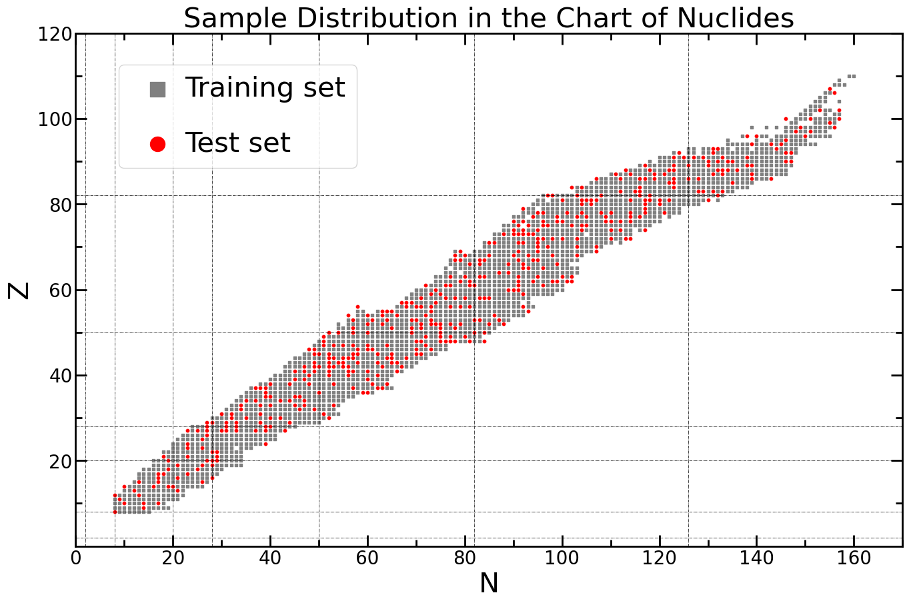

# Deep Learning for Nuclear Mass Prediction

## Description
This project focuses on training neural networks to predict the residuals (in MeV) between nuclear phenomenological models and experimental data, with physical features as inputs.

Design custom Neural Network (NN) architectures in the model repository `model_repo.py`, and train their parameters on the dataset (e.g. AME2020) to predict experimentally unknown data.

You can play with this project by selecting whatever features, labels, model architecture, optimizer, etc. to see how the model's performance varies.

## Table of Contents
- [1. Prepare Data](#1-prepare-data)
- [2. Train a Model](#2-train-a-model)
- [3. Analysis](#3-analysis)
- [License](#license)

## 1. Prepare Data

### Steps:
1. **Features and Labels**: Choose features and labels for the model to train on, based on Physics.
2. **Data Read**: `data_read()` reads dataset.
3. **Data Split, Load and Plot**: `split_and_load()` splits and loads data into training and testing data loaders, also plots the data distribution across the chart of nuclides for visualization.

### Example Code:
```python
# Configuration and Hyperparameters
FEATURES = ['Z', 'N', 'N-Z', 'A', 'P', 'D']
LABELS = ['LDM_residual(MeV)']
RANDOM_SEED = 39
TRAIN_PROPORTION = 0.8 # 80% for training, 20% for testing

import config as cf
from myutils.data_util import data_read, split_and_load
DATASET = data_read(features=FEATURES, labels=LABELS, filepath=cf.TRAIN_DATA_PATH)
TRAIN_LOADER, TEST_LOADER = split_and_load(dataset=DATASET, 
                                           random_seed=RANDOM_SEED, 
                                           train_proportion=TRAIN_PROPORTION)
```


## 2. Train a Model

### Steps:
1. **Model Architecture**: Build/Choose an architecture in the model repository `model_repo.py`.
2. **Optimizer and Scheduler**: Set up the optimizer, scheduler, etc.
3. **Model Training**: Train the model on the training dataset, and test its performance with the test dataset.
4. **Monitoring**: Visualize the training process by plotting the learning curve.
5. **Prediction**: Based on the trained model parameters, make predictions.

### Training Example:

```python
from myutils.model_training_util import train_model, monitor_learning, model_predict
import model.model_repo as model_repo

MODEL = model_repo.Model20241223a().to(cf.device)
OPTIMIZER = optim.AdamW(MODEL.parameters(), lr=0.001)
SCHEDULER = optim.lr_scheduler.StepLR(OPTIMIZER, step_size=10000, gamma=0.1)

train_model(epochs_add=2000,
            model=MODEL,
            train_loader=TRAIN_LOADER,
            test_loader=TEST_LOADER,
            optimizer=OPTIMIZER,
            monitor_interval=1000,
            scheduler=SCHEDULER,
            use_early_stopping=True,
            patience=10)

monitor_learning(MODEL, TRAIN_PROPORTION)

model_predict(MODEL, DATASET)
```

`epochs_add`: How many epochs to train this time.

`monitor_interval`: The interval for monitoring the training process, also representing the space between two checkpoints in the learning curve.

`patience`: Stop training to avoid overfitting if no improvement is observed on test dataset after a certain number of epochs.


## 3. Analysis

### 1. **PLot and Compare the Residual Heatmap**

 Example Code:

```python
from myutils.plot_util import plot_residual_heatmap
MODEL = model_repo.Model20241220a().to(cf.device)
PHYSICAL_MODEL='LDM_residual(MeV)'
plot_residual_heatmap(model=MODEL, 
                      physical_model_name=PHYSICAL_MODEL,
                      scaled=False)
```


### 2. **Plot the Residuals on an Isotopic Chain**

Example Code:

```python
from myutils.plot_util import plot_isotopic_res
MODEL = model_repo.Model20241220a().to(cf.device)

BEST_PARAMETER_PATH = f"model/parameter/param_{MODEL.__class__.__name__}.pth"
MODEL.load_state_dict(torch.load(BEST_PARAMETER_PATH))
print(f"Optimal parameters loaded from `{BEST_PARAMETER_PATH}`\n")

plot_isotopic_res(model=MODEL, Z = 88, input_neurons = ['Z', 'N', 'N-Z', 'A', 'P', 'D'])
```


### 3. Nucleon Separation Energy

Example Code:

```python
from myutils.plot_util import plot_nuclide_sep_performance
MODEL = model_repo.Model20241220a().to(cf.device)
plot_nuclide_sep_performance(physical_model_name='LDM', model=MODEL)
```

## License

This project is licensed under the MIT License. See the [LICENSE](LICENSE) file for details.